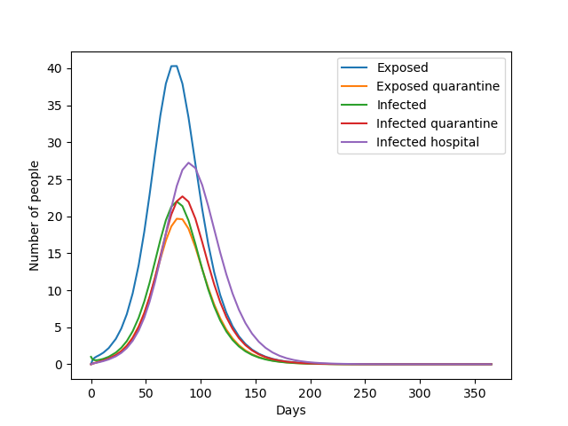
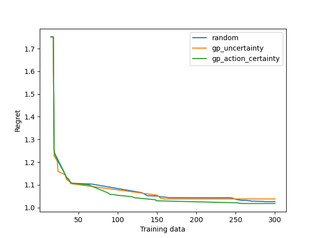

# Gaussian process emulation of epidemic models and decision-making

This repository contains code used for the 
_AI for Decision-Making proposal: Machine learned models from simulation data_ project.

### Software
This project was written in Python 3.8. The Gaussian processes software used is
[GP Flow](https://github.com/GPflow/GPflow), which relies on [TensorFlow](https://www.tensorflow.org/install/pip). 
Otherwise, the project uses standard
python modules including `numpy`, `scipy`, `matplotlib` and `pandas`.

### Repository strucutre
This repo contains all the code used to produce all results in the report. 
The main project code is in `emulator.py` in the class `DynamicEmulator`. 
This is the class that ties the Gaussian Process to the simulation.
The code that reproduces report figures is in `emulator_deterministic_example.py`. 
This code uses the deterministic epidemic model, defined in `models/epi_model_deterministic.py`.
The repository contains other models that could be used in the `DynamicEmulator` framework,
including the stochastic model in `models/epi_model_example.py`, but this was not included 
in the report due to issues in fitting the Gaussian Processes to a stochastic model.
In particular, a stochastic model creates a challenge when assessing how a new training
data point will reduce uncertainty because it is not straightforward to find out
whether a point is uncertain because there is a lack of data or because the model is stochastic.

### Report figures
- Figure 3 is generated by running `models/epi_model_deterministic.py`,
and the figure is `models/model_figures/SEIR_example_plot.png`
 
- Figure 4 is generated by running `emulator_deterministic_example.py`
and the figure is `figures/test_set_regret_removed_all_vals.png`.
